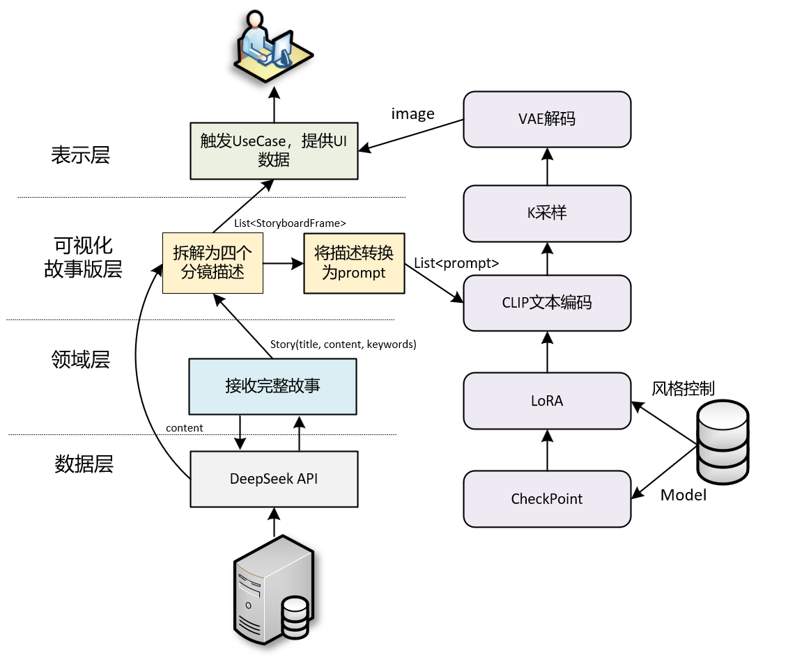

# VocabVerse：AI驱动的沉浸式单词记忆APP 1.0

[](https://kotlinlang.org)


**VocabVerse** 是一款革命性的安卓单词学习应用，通过前沿AI技术将枯燥的单词记忆转化为沉浸式叙事体验。本应用基于认知科学原理，结合大语言模型与图像生成技术，为四六级、考研、雅思/托福考生提供高效的单词记忆解决方案。

## 🔍 项目概述

VocabVerse 解决了传统单词学习的三大痛点：
- **告别机械重复**：通过AI生成的情境故事取代枯燥的单词列表
- **突破图片依赖**：动态漫画呈现单词语义，避免"只记图不记词"
- **强化实际应用**：在真实语境中掌握词汇用法，解决"背了不会用"

测试数据显示，相比传统工具（如百词斩/墨墨），记忆留存率提升至少85%。

## ✨ 核心功能

### 📖 AI情境故事生成
- 基于DeepSeek大语言模型动态生成故事
- 单词自然融入叙事场景

### 🎨 智能漫画生成
- Stable Diffusion生成四格漫画
- SD-LoRA微调技术保障角色一致性

### 🔄 自适应学习系统
- 基于用户行为和评分动态优化生成内容（2.0推出）
- 真题库智能匹配（四六级/考研/雅思/托福）

## 其他功能
### 学习数据可视化
- 词汇量轨迹
- 实时学习进度

### 学习笔记
- 生词列表
- 错词笔记

### 辅助功能
- 词库检索
- 音标列表
- 词根词缀
- 谐音记忆
- 拍照翻译
- 每日阅读
- 主题/换肤

## 📸 展示


## 🛠️ 技术架构




## ⚙️ 安装与配置

### 环境要求
- IntelliJ IDEA 或 Android Studio
- Android SDK 33
- 安卓虚拟机
- DeepSeek API 和 Stable Diffusion API 访问权限（需连接山东大学校园网）

### 部署
克隆：
```
git clone https://github.com/xxtd223/word-learning-software.git
```

IntelliJ IDEA/Android Studio中编译运行：

导入项目

同步Gradle依赖

在安装虚拟机中运行或在build目录中生成APK在安卓机运行

**注**：AI 功能需要连接山东大学校园网以获取服务端支持

服务器地址与KEY放在local.properties文件中

## 🙏 致谢
本项目由山东大学赞助支持